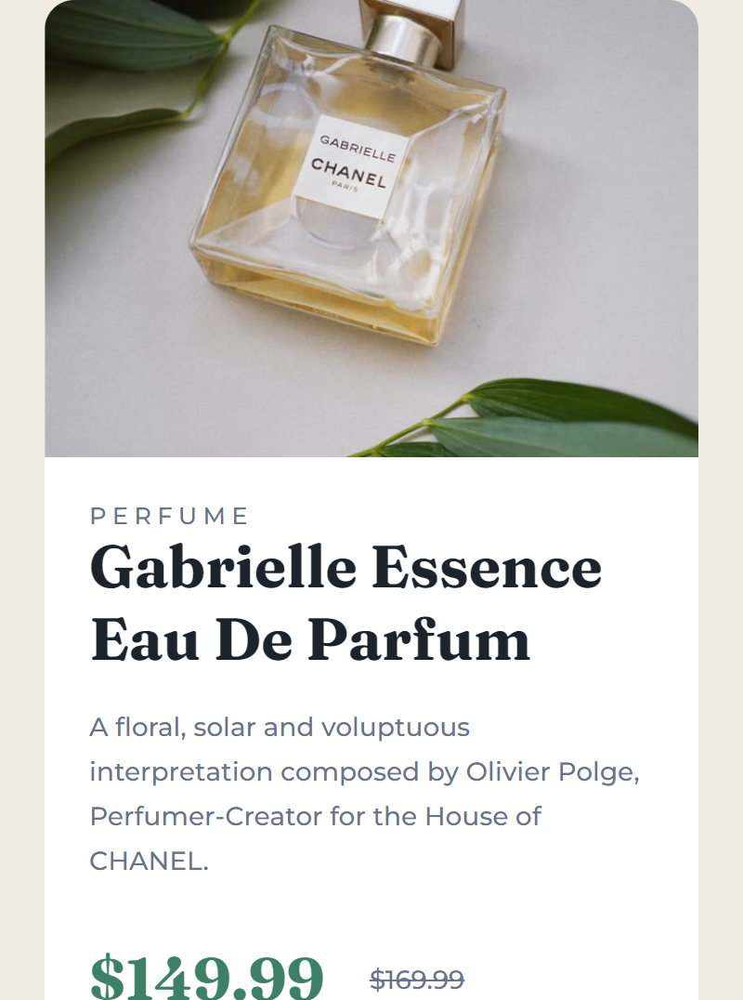

# Frontend Mentor - Product preview card component solution

-Live Site URL: [Live Site](https://amkolpin.github.io/Product-Preview-Solution-Frontend-Mentor/)

This is a solution to the [Product preview card component challenge on Frontend Mentor](https://www.frontendmentor.io/challenges/product-preview-card-component-GO7UmttRfa). Frontend Mentor challenges help you improve your coding skills by building realistic projects. 

## Table of contents

- [Overview](#overview)
  - [The challenge](#the-challenge)
  - [Screenshot](#screenshot)
  - [Links](#links)
- [My process](#my-process)
  - [Built with](#built-with)
  - [What I learned](#what-i-learned)
  - [Continued development](#continued-development)
  - [Useful resources](#useful-resources)


## Overview

### The challenge

Users should be able to:

- View the optimal layout depending on their device's screen size
- See hover and focus states for interactive elements

### Screenshots
!Desktop Site
Mobile Site


## My process

### Built with

- Semantic HTML5 markup
- CSS custom properties


### What I learned

I tried alot of different things for this challenge. I first had trouble setting the srcset with the source::media tags. I thought that it would point to the images folder, but that is not the case. I also tried out main, article, nth-child tags and use rem units instead of px. 

This is the code that I was having trouble with. See how srcset doesn't have an underlined path to images. 

```html    
<picture>
        <source media="(min-width:640px)" srcset="images/image-product-desktop.jpg">
        
</picture>
```

### Continued development

I am still not quite understanding how flexbox works with all of the different elements and how to quickly make them equal to eachother.


### Useful resources

- [W3Schools](https://www.w3schools.com/css/default.asp) - I use W3Schools to learn about the differnt size types and tags that I used 
- [Youtube Tutorial](https://www.youtube.com/watch?v=XghPJQ1Oeks&t=16s&ab_channel=IrvineMesa) -This is the tutorial that I skimmed through that helped me with the srcset problem and helped me find another way to make the picture and imfo the same size.

